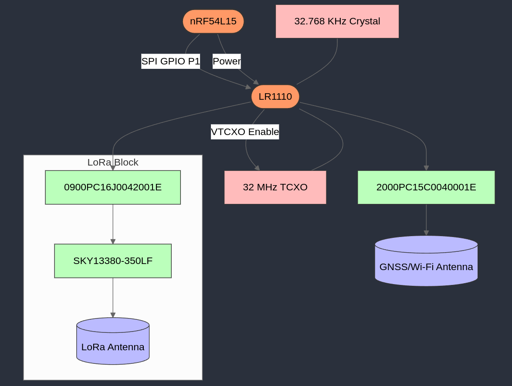

# LR1110 Expansion Board for nRF54L15-DK

This expansion board connects the Semtech LR1110 RF transceiver to the Nordic nRF54L15-DK. The board enables LoRa, GNSS, and Wi-Fi scanning capabilities.

  

## Features

- Supports LoRa connectivity via 0900PC16J0042001E filter and SKY13380-350LF RF switch
- GNSS and Wi-Fi scanning via 2000PC15C0040001E filter (IPDs enable smaller solution size)
- Onboard LNA for non-active GNSS antennas
- 32 MHz TCXO with power-saving VTCXO control from LR1110
- 32.768 KHz crystal for timing reference
- Level shifters to support all possible IO voltages of the nRF54L15
- Compatible with the new nRF54L15 headers
